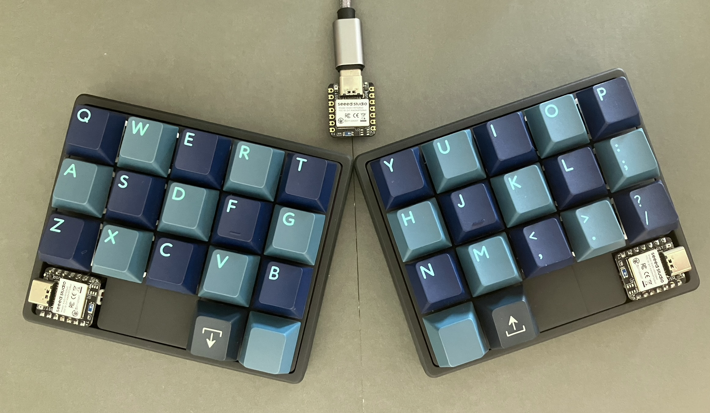

# Thorium keyboard

## Features
- ortholinear  
- 34-keys
- wireless
- split
- dongle  
- MX switches, hotswap 
- small PCB (96mm*77mm)
- 3D printed cases and plates
- Lipo battery (260mAh)
- Seeed Studio XIAO nRF52840
- ZMK Firmware
## Resources
- [Build guide](./doc/buildguide.md)
- PCB Files (KiCAD7, .zip(gerbers)): [Left](https://github.com/note96e/thorium/tree/main/pcbl) | [Right](https://github.com/note96e/thorium/tree/main/pcbr)
- 3DP Files (.f3d, .step): [Cases and plates](https://github.com/note96e/thorium/tree/main/case)
- ZMK Firmware configuration files: [Config](https://github.com/note96e/thorium-zmk-config) | [Reset](https://github.com/note96e/thorium-reset-zmk-config)

## License
- [MIT](https://github.com/note96e/thorium/blob/main/LICENSE.txt)
