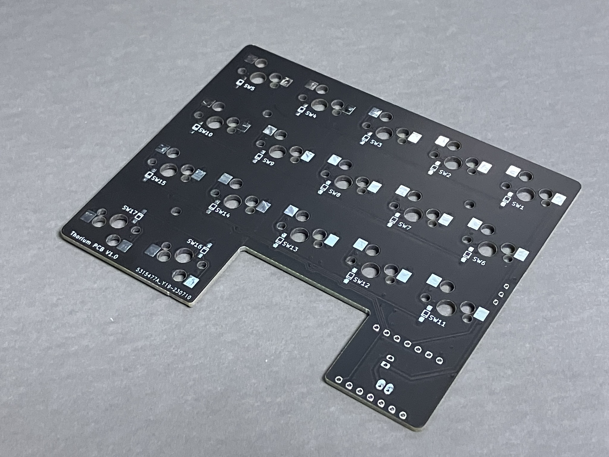
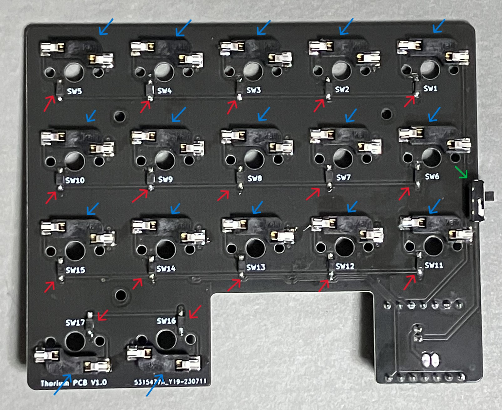
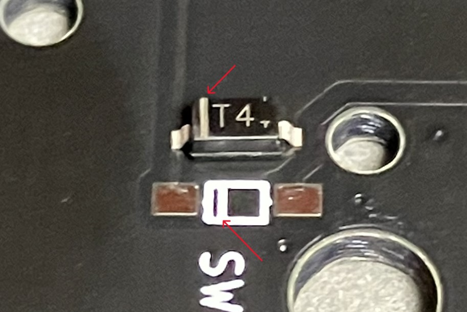
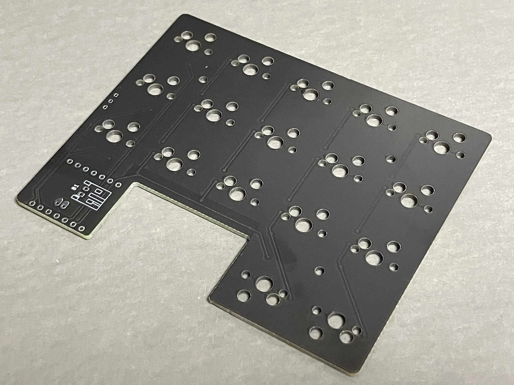
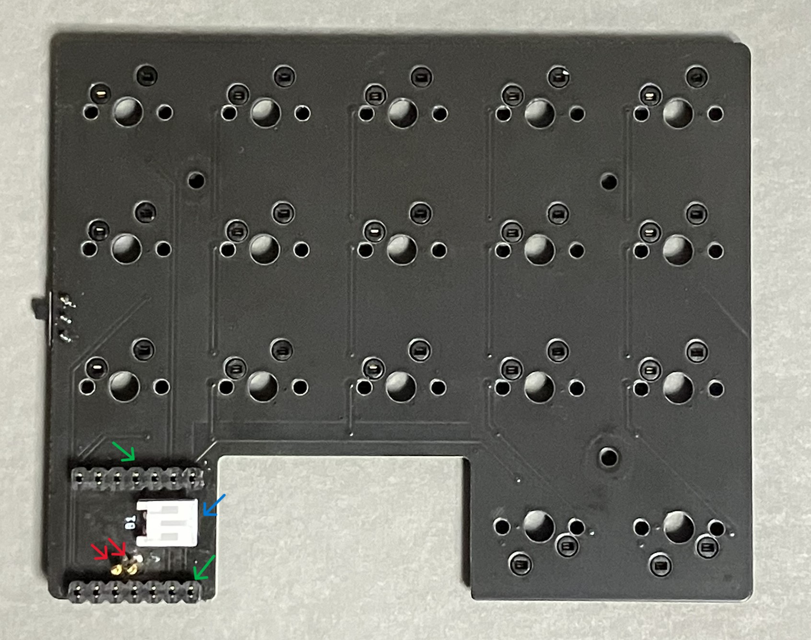
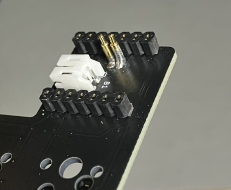
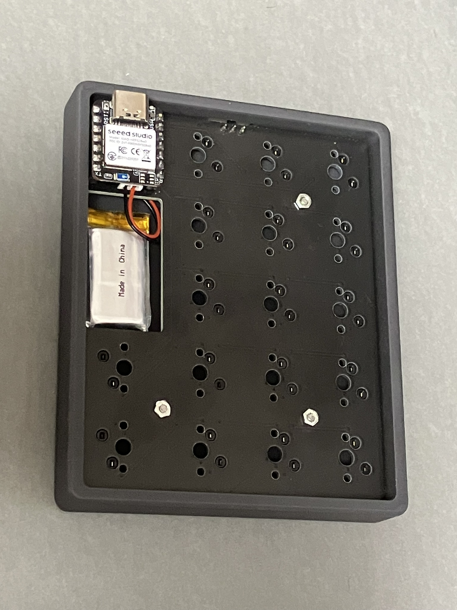
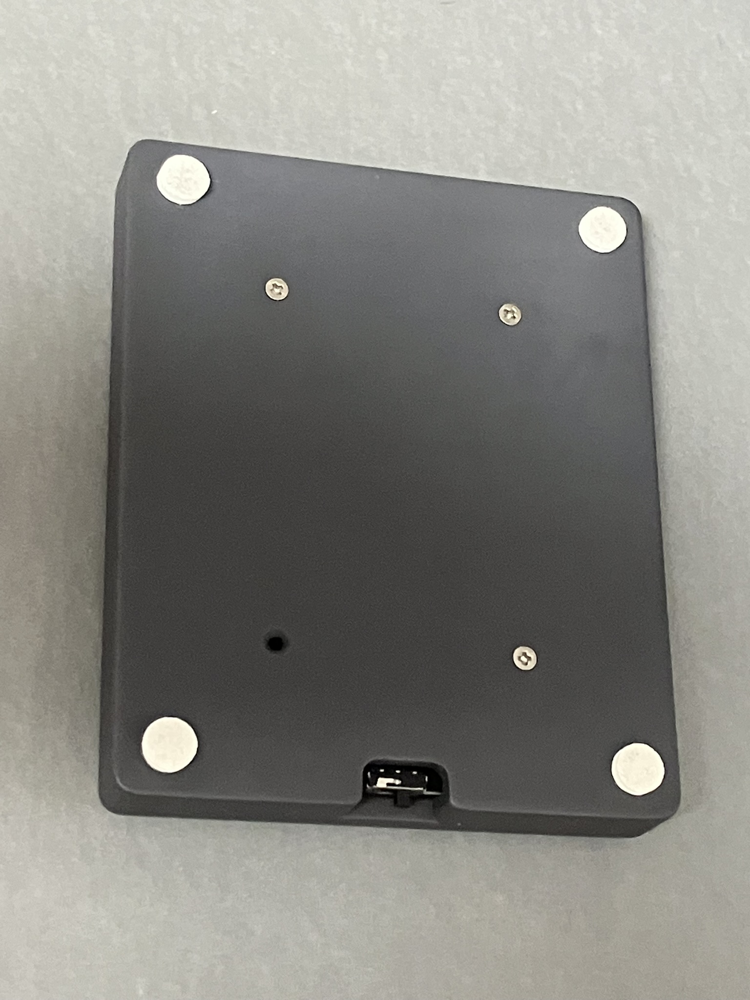
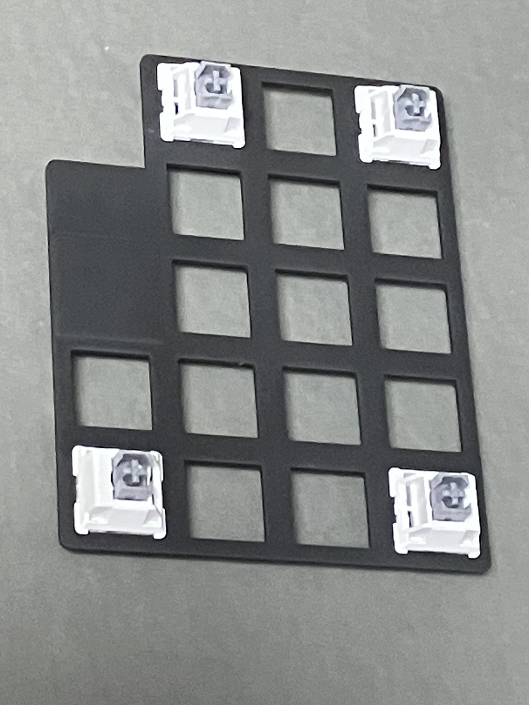
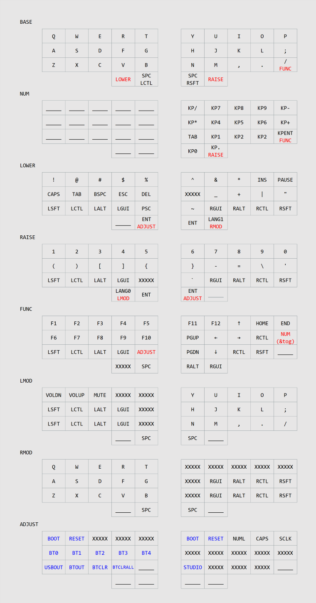

# Build guide

## Parts list

### 3D printed parts
- Case (2)
- Switch Plate (2)

You can download Fusion 360 files (.f3d) and STEP files.    
https://github.com/note96e/thorium/tree/main/case  
STEP files can be ordered from JLCPCB (Black Resin is recommended).  

### PCB (Thickness: 1.6mm)
You can download KiCAD7 data.  
- Left half (1)
    - https://github.com/note96e/thorium/tree/main/pcbl
- Right half (1)
    - https://github.com/note96e/thorium/tree/main/pcbr

The following files are Gerber files. You can order them from JLCPCB.  
thorium_pcbl.zip, thorium_pcbr.zip

### Parts to be soldered to the front side of PCB
- Pogo pin: RTLECS GB15-07020-0818-2A (4)
    - AliExpress https://www.google.com/search?q=RTLECS+GB15-07020-0818-2A
- JST PH box header: S2B-PH-K-S (2)
- 7x1 female socket header THD pitch: 2.54mm height 3.5mm (4)

### Parts to be soldered to the back side of PCB
- Diode: 1N4148 / 1N4148W SOD-123 (34)
- Kailh hot swapping pcb socket for MX switch (34)
- Power switch: MSK-12D19 (2)
    - AliExpress https://www.google.com/search?q=MSK-12D19

### Other parts
- Seeed Studio XIAO nRF52840 (3)
- 7x1 male pin header THD pitch: 2.54mm height 2.5mm (4)
- Lipo Battery: EEMB LP601730 with JST PH Connector 3.7V 260mAh (2)
    - Amazon  https://www.amazon.com/dp/B09DPN31KM
- Cherry MX switch or compatible (34)
- Keycaps for Cherry MX switch (34)
- Countersunk Head Screw M2 10mm (6)
- Hex nut M2 1.2mm (6)
- Bumpon
- Type-C USB Cable

#### Note
Pogo pins and Lipo batteries are not widely available. Alternatives may not work well.  
When using Lipo batteries, make sure they have an over-discharge protection circuit and that the polarity is correct.

## Tools
- Soldering iron
- Solder
- Solder wick
- Flux (Recommended)
- Flux remover (Recommended)
- Tweezers
- Screwdriver

# Assembly
Assemble each half of the keyboard in the following order.
- Solder the parts on the back side of the PCB.  

    - Diodes (Red. Note orientation) -> Switch sockets (Blue) -> Power switch (Green)

- Solder the parts on the front side of the PCB.
  
    - Pogo pins (Red) -> JST PH box header (Blue) -> Socket headers (Green)
  
  
- Solder male pin headders to XIAO.
- Install the battery.
- Install XIAO.
- Fix the PCB to the case with screws and nuts.  
  
 
- Install the MX switches.
    - Install the switches on the four corners into the switch plate, then install them on the PCB.
 
    - Install the remaining switches.
- Install the keycaps.

#### Note
Pogo pins must be soldered vertically to avoid shorts and contact failures. I could not find a way to solder them well.  
The distance between the back side of XIAO and the front side of the PCB is 6 to 7 mm. Cut the pins of the pin headers to adjust if necessary.

## Charging
Charge the battery after assembly.  
Connect XIAO to a PC or charger with the USB cable, and turn the slide switch ON (front side). The green LED on XIAO will light up and charging will begin.  
When charging is complete, the green LED will turn off. Disconnect the USB cable and turn the slide switch OFF.

# Firmware

Please refer to the official ZMK Firmware documentation for instructions on how to flash firmware, change keymap, etc.  

You can download UF2 file from the following link.  
https://github.com/note96e/thorium-zmk-config/releases  
After downloading, unzip the thorium-x.x.x.zip file.
- Dongle: thorium-seeeduino_xiao_ble-zmk.uf2  
- Left half: thorium_left-seeeduino_xiao_ble-zmk.uf2  
- Right half: thorium_right-seeeduino_xiao_ble-zmk.uf2  

You can download the UF2 file for the dongle and each half pairing reset.   
https://github.com/note96e/thorium-reset-zmk-config/releases  
After downloading, unzip the thorium-reset-x.x.x.zip file. 
- Dongle: thorium_reset-seeeduino_xiao_ble-zmk.uf2  
- Left half: thorium_reset_left-seeeduino_xiao_ble-zmk.uf2  
- Right half: thorium_reset_right-seeeduino_xiao_ble-zmk.uf2  
In the left and right halves, the first row of keys is assigned to &bootloader.

## Default keymap
  
The second line describes the behavior when holding the key.  
The red text turns on the layer when the key is held.  
The blue text is assigned the following key codes in ZMK.  
- BOOT: &bootloader
- RESET: &sys reset
- BT0 ~ BT4: &bt BT_SEL 0 ~ &bt BT_SEL 4
- USBOUT: &out OUT_USB
- BTOUT: &out OUT_BLE
- BTCLR: &bt BT_CLR
