# ビルドガイド

## パーツリスト
カッコ内は必要数です。

### 3Dプリンタで作成するパーツ
- ケース (2)
- トッププレート (2)

以下からFusion 360のファイル(.f3d)と、.stepファイルがダウンロードできます。  
https://github.com/note96e/thorium/tree/main/case  
.stepファイルは、そのままJLCPCBで注文できます(Black Resinがお勧めです)。  

### PCB (厚さ1.6mm)
以下からKiCad7のデータをダウンロードできます。  
- 左側 (1)
    - https://github.com/note96e/thorium/tree/main/pcbl
- 右側 (1)
    - https://github.com/note96e/thorium/tree/main/pcbr

次のファイルはGerberファイルです。そのままJLCPCBで注文できます。  
thorium_pcbl.zip, thorium_pcbr.zip

### PCBの表側にハンダ付けするパーツ
- ポゴピン: RTLECS GB15-07020-0818-2A (4)
    - AliExpress https://www.google.com/search?q=RTLECS+GB15-07020-0818-2A
- JST PH コネクタ ベース付ポスト: S2B-PH-K-S (2)
    - 秋月電子 https://akizukidenshi.com/catalog/g/gC-12633/
- 7x1 ピンソケット: スルーホール 2.54mmピッチ 高さ3.5mm (4)
    - 遊舎工房 https://shop.yushakobo.jp/products/3696  
    ※7ピン分切り離して使用します。

### PCBの裏側にハンダ付けするパーツ
- ダイオード: 1N4148 / 1N4148W SOD-123 (34)
    - 遊舎工房 https://shop.yushakobo.jp/products/a0800di-02-100
- Kailh MXホットスワップソケット (34)
    - 遊舎工房 https://shop.yushakobo.jp/products/a01ps
- スライドスイッチ: MSK-12D19 (2)
    - 遊舎工房 https://shop.yushakobo.jp/products/5624

### その他のパーツ
- Seeed Studio XIAO nRF52840 (3)
    - 秋月電子 https://akizukidenshi.com/catalog/g/gM-17341
- 7x1 ピンヘッダ スルーホール 2.54mmピッチ 高さ2.5mm (4)
    - 遊舎工房 https://shop.yushakobo.jp/products/3696  
    ※7ピン分切り離して使用します。
- Lipoバッテリー: EEMB LP601730 JST PH コネクタ付 3.7V 260mAh (2)
    - Amazon https://www.amazon.co.jp/dp/B09DPN31KM
- Cherry MX スイッチまたは互換品 (34)
- Cherry MX用 キーキャップ (34)
- 皿ねじ M2 10mm (6)
- 六角ナット(三種) M2 1.2mm (6)
- ケース裏に貼るクッションゴム (必要なだけ)
- Type-C USBケーブル (1)

#### 注意
ポゴピンとLipoバッテリーは入手方法が限られます。代替品ではうまく動作しない可能性があります。特にLipoバッテリーに関しては、(過放電)保護回路の有無と極性に注意して下さい。バッテリーには保護回路が必要です。  

## ツール
- ハンダごて
- ハンダ
- ハンダ吸取線
- フラックス (推奨)
- フラックスリムーバー (推奨)
- ピンセット
- ドライバー

## 組み立て
以下の順番でキーボードの左側・右側を組み立てます。以下の写真は左側です。  
1. PCBの裏側のパーツをハンダ付けします。  
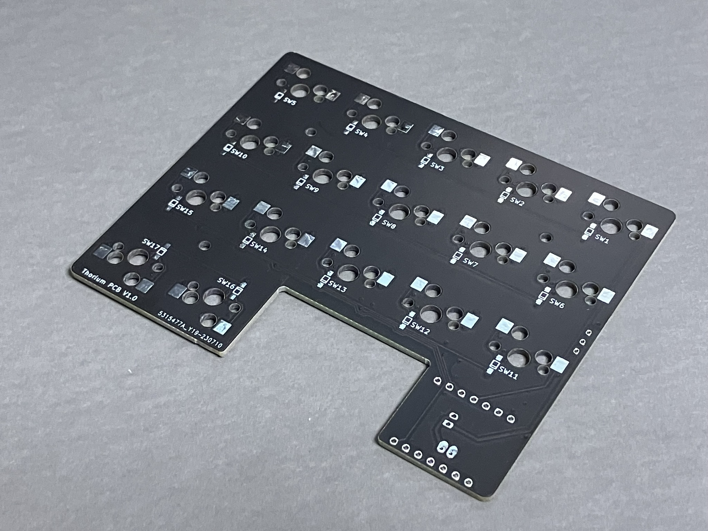
    - ダイオード(写真赤。向きに注意) -> ソケット(青) -> スライドスイッチ(緑)  
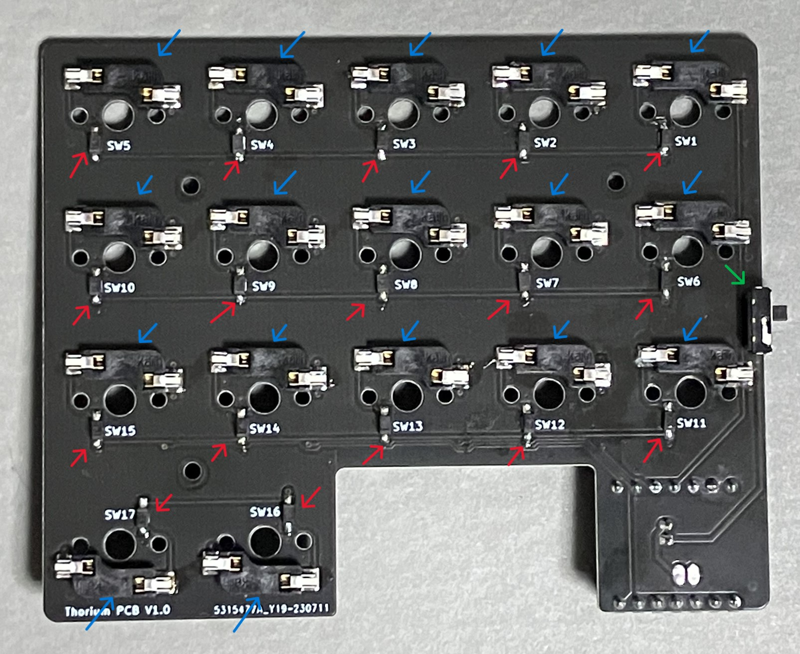
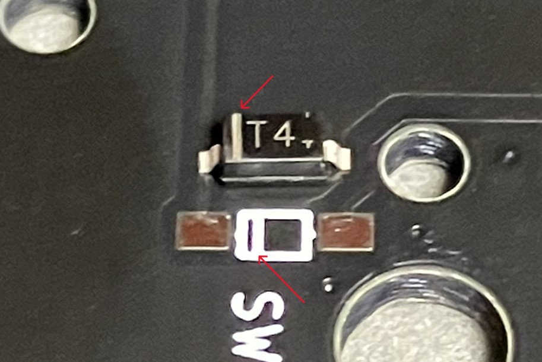
1. PCBの表側のパーツをハンダ付けします。  
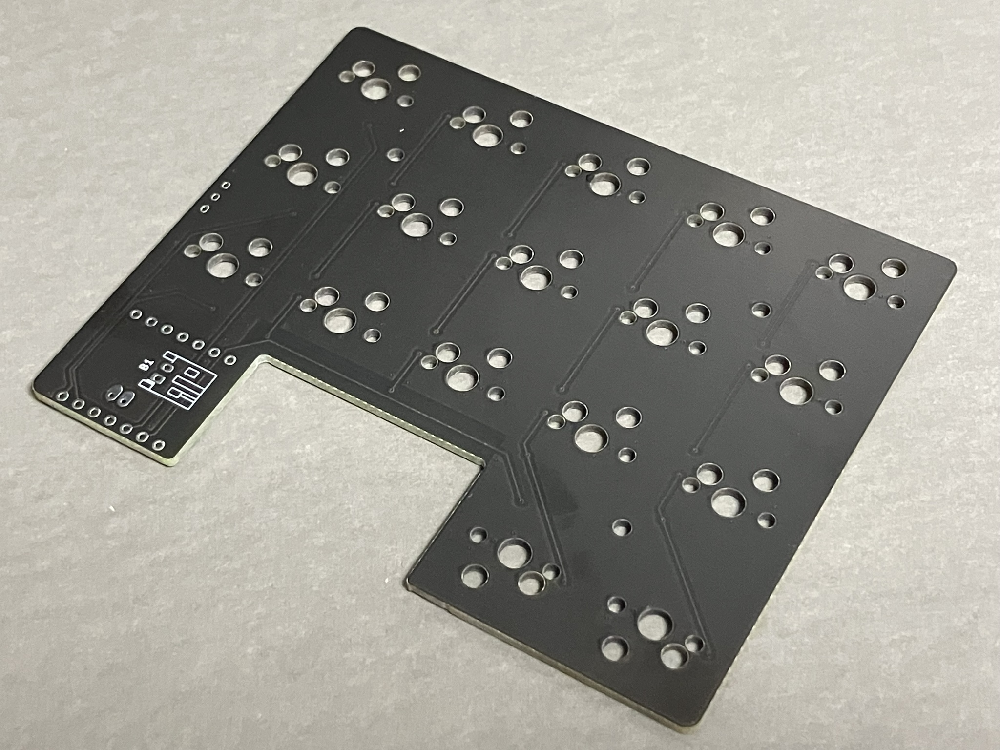  
    - ポゴピン(写真赤) -> JST PH コネクタ(青) -> ピンソケット(緑)  
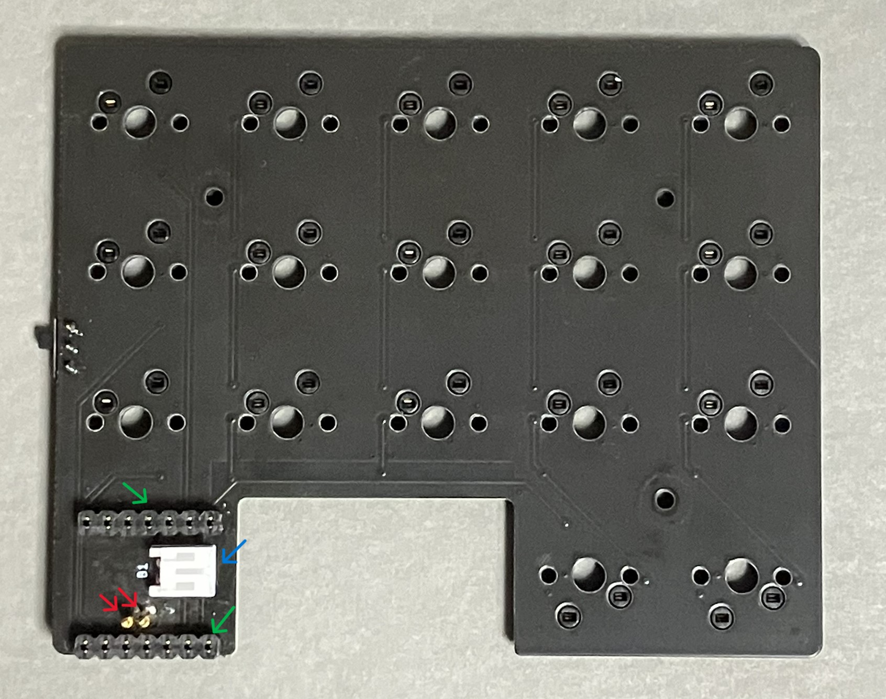  
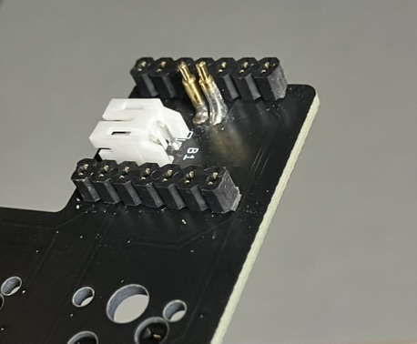  
1. XIAOにピンヘッダをハンダ付けします。  
1. バッテリーを取り付けます。  
1. XIAOを取り付けます。  
1. ネジとナットでPCBをケースに固定します。  
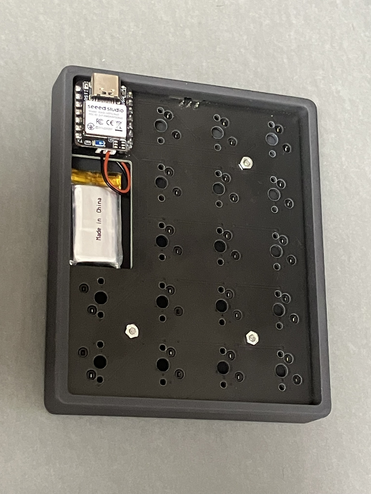  
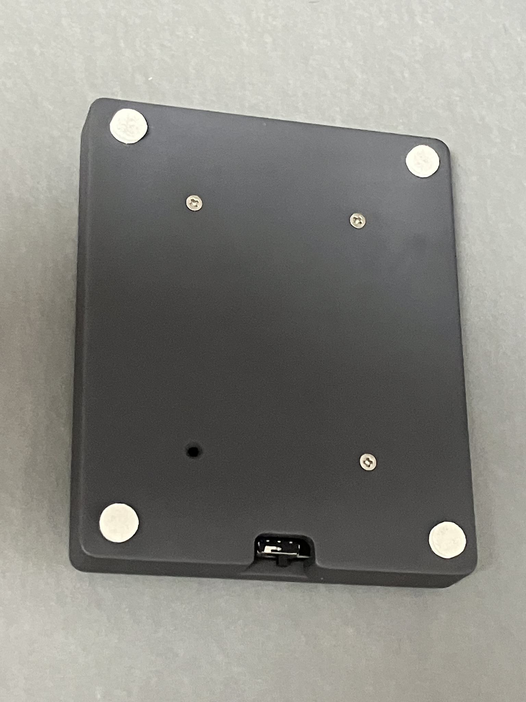 
1. MXスイッチを取り付けます。  
    - 四隅のスイッチをトッププレートに取り付けてから、PCBに取り付けます。  
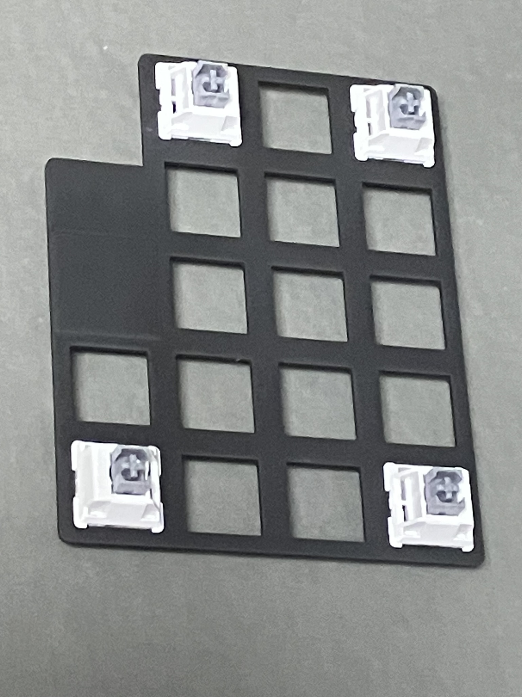   
    - 次に残りのスイッチを取り付けます。  
1. キーキャップを取り付けます。  

#### 注意
ポゴピンはショート及び接点不良を避ける為、垂直にハンダ付けする必要があります。うまくハンダ付けする方法は編み出せませんでした。
XIAOの裏側とPCBの表側の間隔は6～7mmです。必要に応じてピンヘッダのピンをカットして調整して下さい。

## 充電
組み立てた後にバッテリーを充電して下さい。  
USBケーブルでXIAOをPCまたは充電器に接続しスライドスイッチをON(手前側)にすると、XIAOの緑色のLEDが点灯し充電が開始します。  
充電が完了したら緑色のLEDが消えますので、USBケーブルを外してスライドスイッチをOFFにして下さい。

# ファームウェアの書き込み
ここで使用している用語は、あまり正確ではありません。ご容赦下さい。

以下からコンパイル済のファームウェアをダウンロードできます。  
https://github.com/note96e/thorium-zmk-config/releases  
thorium-x.x.x.zipをダウンロードして解凍してください。   
v2.0.0からZMK Studioに対応しています。

### 初回のファームウェア書き込み
初回のファームウェア書き込みはトラブルを避ける為、以下の手順で慎重に行ってください。  
1. 左側・右側のXIAOはケーブルを外し、スイッチをOFFにして、完全に動作しない状態にします。  
1. ドングル役のXIAOをケーブルで接続して、XIAOのリセットボタンをダブルクリックするとドライブとしてマウントされます。解凍した次のファイルを当該ドライブにドラッグアンドドロップして下さい。  
thorium_dongle-seeeduino_xiao_ble-zmk.uf2
1. ファームウェアの書き込みが始まり、終了するとドライブがアンマウントされます。一旦、ここでドングル役のXIAOはケーブルから取り外して完全に動作しない状態にします。
1. 同様に左側のXIAOに対して以下のファイルを書き込みます。書き込んだらケーブルを外して完全に動作しない状態にします。  
thorium_left-seeeduino_xiao_ble-zmk.uf2
1. 同様に右側のXIAOに対して以下のファイルを書き込みます。書き込んだらケーブルを外して完全に動作しない状態にします。  
thorium_right-seeeduino_xiao_ble-zmk.uf2
1. ドングル役のXIAOをPCにケーブル接続、すぐに左側・右側のスイッチをONにするとドングルー左側間、ドングルー右側間のペアリングが行われ、キーボードとして動作する様になります。  

この手順でファームウェアの書き込みを行うのは、初回＝ドングルと左右側が未ペアリングの状態の場合のみです。ぺアリングは一度行えばよく、ファームウェアを上書きしても維持されます。その為、ペアリング後は書き込み時にケーブルを外したり、左側・右側のスイッチをOFFにする必要はありません。
ペアリングがうまく行われなかったと思われる場合は、次のペアリング解除を行った上で、再トライして下さい。

### ドングルー左側・右側間のペアリング解除
ドングルー左側・右側のペアリングの解除は解除用のファームウェアを書き込んで行います。以下からコンパイル済の解除用ファームウェアをダウンロードできます。  
https://github.com/note96e/thorium-reset-zmk-config/releases  
thorium-reset-x.x.x.zipをダウンロードして解凍して下さい。  
解除・再ペアリングは以下の手順で行って下さい。
1. 左側・右側のXIAOはケーブルを外し、スイッチをOFFにして、完全に動作しない状態にします。
1. ドングル役のXIAOをケーブルに接続し、前述の解凍した以下のファームウェアを書き込みます。書き込んだらケーブルを外して完全に動作しない状態にします。  
thorium_reset_dongle-seeeduino_xiao_ble-zmk.uf2
1. 左側のXIAOをケーブルに接続し、解凍した以下のファームウェアを書き込みます。書き込んだらケーブルを外して※完全に動作しない状態にします。  
thorium_reset_left-seeeduino_xiao_ble-zmk.uf2
1. 右側のXIAOをケーブルに接続し、解凍した以下のファームウェアを書き込みます。書き込んだらケーブルを外して※完全に動作しない状態にします。  
thorium_reset_left-seeeduino_xiao_ble-zmk.uf2
1. これでペアリングが解除された状態に戻ります。前述の初回のファームウェア書き込みを行ってください。

※左側・右側は解除用のファームウェアを書き込み後、1行目のキーのどれかを押せば、ファームウェア書き込み可能な状態になります。ケーブルを外す代わりに1行目のキーを押すだけでも構いません。

### キーマップ
デフォルトのキーマップは下図の通りです。2行記載されているキーは1行目がタップ時の動作、2行目がホールド時の動作になります。  
赤字はレイヤー切り替えで、ホールド時にレイヤーがONになります。レイヤーについてはZMKの公式ドキュメントを参照して下さい。  
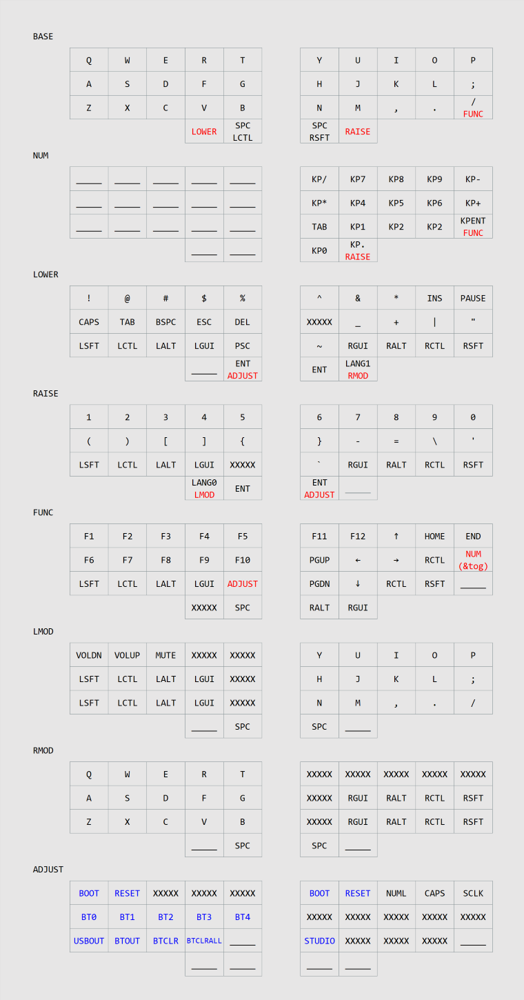

ADJUSTレイヤーは特殊キー(青文字)が設定されています。カッコ内はZMKのキーコードです。  

- BOOT (&bootloader)
    - キーを押すと、左側・右側のXIAOがPCとケーブルで接続されている場合、ファームウェアを書き込みできる状態になります。左側のBOOTは左側、右側のBOOTは右側に対して動作します。  
    - XIAOのリセットスイッチは押しづらく耐久性も無いため、基本的にはこのキーを使用して下さい。なお、ドングル側が動作していない場合は動作しません。
- RESET (&sys reset)
    - 左側・右側を再起動します。左側のRESETは左側、右側のRESETは右側に対して動作します。
- BT0 ~ BT4 (&bt BT_SEL 0 ~ &bt BT_SEL 4)
    - Blutoothのプロファイル＝接続先(の情報)を切り替えます。
- USBOUT (&out OUT_USB)
    - 出力先をBluetoothからUSBに切り替えます。ドングルがUSBでPCと接続されている場合のみ動作します。
- BTOUT (&out OUT_BLE)
    - 出力先をUSBからBluetoothに切り替えます。
- BTCLR (&bt BT_CLR)
    - 選択中のBluetoothのプロファイルのペアリングをクリアします。PC側もクリアの操作を行ってください。
- BTCLRALL (&bt BT_CLR_ALL)
    - 全てのBluetoothのプロファイルのペアリングをクリアします。PC側もクリアの操作を行ってください。
- STUDIO (&studio_unlock)
    - ZMK Studio使用時にアンロックします。

### Bluetooth接続とUSB接続
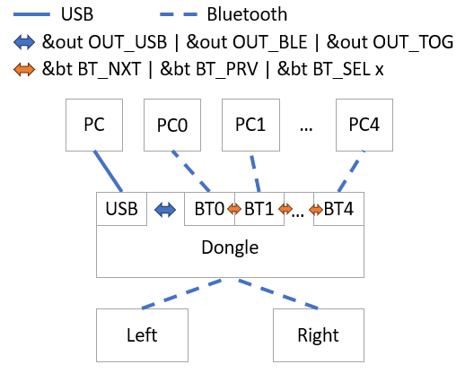  
Bluetoothキーボードとしては、複数のPC※とペアリング(ボンディング)、同時接続して切り替えながら使用可能です。  
※コンパイル済のFirmwareでは5台まで。  
またドングルがケーブルでPCに接続されている場合は、USBキーボードとしても動作します。Bluetooth接続のみで使用するのであれば、ドングルはPCに接続する必要はありません。ドングルに電源が供給されていればOKです。

### キーマップの変更
ZMK Studioでキーマップが変更可能です。詳細はZMKの公式ドキュメントを参照して下さい。  
ZMK Studioで対応できないキーマップの変更は、都度ファームウェアをコンパイルして書き込む必要があります。コンパイル環境を整えるのがベストですが、かなり手間ががかります。  
比較的手間がかからない方法は、自前のGitHubアカウントにリポジトリをフォークし、Actionsを使用してコンパイルを行う方法です。  
1. 自分のGitHubアカウントに以下のリポジトリをフォークします。  
https://github.com/note96e/thorium-zmk-config/
1. フォークしたリポジトリ上の/config/boards/shields/thorium/thorium.keymapをGitHub上で編集してcommitします。
1. Actionsでワークフローを実行するとコンパイルを開始します。完了したらファームウェアのzipファイルをダウンロードします。  

但し、この方法はコンパイル時間が長めです。

### us2jp
boards/shields/thoriumディレクトリにあるus2jp.keymapとus2jp.hを使用すれば、PCに対して以下を切り替え可能です。

- US配列のキーボードとして振舞う
- JP配列のキーボードとして振舞う

PC側でキーボードが日本語に設定されている場合は、押したキーの文字と違う文字が入力される場合があります(@など)が、JP配列のキーボードとして振舞うようにすれば一致する様になります。勤務先のPC等でキーボードの設定が変更できない場合に有用です。  
ご使用になる場合は、us2jp.keymapをthorium.keymapにリネームしてコンパイルして下さい。ADJUSTレイヤーのUSMODEのキーを押すとUS配列として振舞い、JPMODEのキーを押すとJP配列として振舞います。USMODE、JPMODEのキーの場所はus2jp.keymapで確認して下さい。  
この機能はMod-Morphという機能を用いて実現しています。
