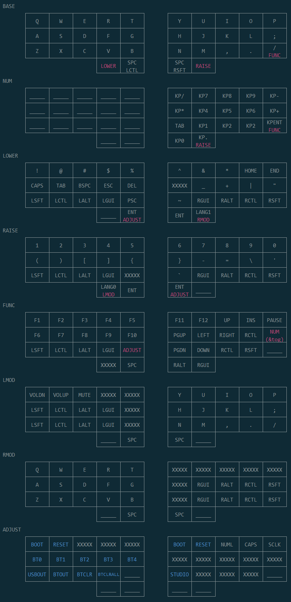

# Build guide

## Parts list

### 3D printed parts
> [!NOTE]
> The design of the case and plate has been partially updated. Please be aware that the actual product may differ slightly from the photos shown.

- Case (Left:1 Right:1)
- Switch Plate (Left:1 Right:1)

You can download Fusion 360 files (.f3d) and STEP files. Files with the old design are stored in the `old` folder.    
https://github.com/note96e/thorium/tree/main/case  
STEP files can be used to order PCBs from JLCPCB (Black Resin is recommended).  

### PCB (Thickness: 1.6mm)
You can download KiCAD7 data.  
- Left half (1)
    - https://github.com/note96e/thorium/tree/main/pcbl
- Right half (1)
    - https://github.com/note96e/thorium/tree/main/pcbr

These files are Gerber files that can be used to order PCBs from JLCPCB.
`thorium_pcbl.zip`, `thorium_pcbr.zip`

### Parts to be soldered to the front side of PCB
- Pogo pin: RTLECS GB15-07020-0818-2A (4)
    - AliExpress https://www.google.com/search?q=RTLECS+GB15-07020-0818-2A
- JST PH box header: S2B-PH-K-S (2)
- 7x1 female socket header THD pitch: 2.54mm height 3.5mm (4)

### Parts to be soldered to the back side of PCB
- Diode: 1N4148 / 1N4148W SOD-123 (34)
- Kailh hot swapping pcb socket for MX switch (34)
- Power switch: MSK-12D19 (2)
    - AliExpress https://www.google.com/search?q=MSK-12D19

### Other parts
- Seeed Studio XIAO nRF52840 (3)
- 7x1 male pin header THD pitch: 2.54mm height 2.5mm (4)
- Lipo Battery: EEMB LP601730 with JST PH Connector 3.7V 260mAh (2)
    - Amazon  https://www.amazon.com/dp/B09DPN31KM
- Cherry MX switch or compatible (34)
- Keycaps for Cherry MX switch (34)
- Countersunk Head Screw M2 10mm (6)
- Hex nut M2 1.2mm (6)
- Bumpon
- Type-C USB Cable

> [!NOTE]
> Pogo pins and Lipo batteries are not widely available. Alternatives may not work well.
  
> [!CAUTION]
> When using Lipo batteries, make sure they have an over-discharge protection circuit and that the polarity is correct.

## Tools
- Soldering iron
- Solder
- Solder wick
- Flux (Recommended)
- Flux remover (Recommended)
- Tweezers
- Screwdriver

# Assembly
Assemble each half of the keyboard in the following order.
- Solder the parts on the back side of the PCB.  

    - Diodes (Red. Note orientation) -> Switch sockets (Blue) -> Power switch (Green)


- Solder the parts on the front side of the PCB.
  
    - Pogo pins (Red) -> JST PH box header (Blue) -> Socket headers (Green)
  
  
- Solder male pin headders to XIAO.
- Install the battery.
- Install XIAO.
- Fix the PCB to the case with screws and nuts.  
  
 
- Install the MX switches.
    - Install the switches on the four corners into the switch plate, then install them on the PCB.
 
    - Install the remaining switches.
- Install the keycaps.

> [!NOTE]
>Pogo pins must be soldered vertically to avoid shorts and contact failures. I could not find a way to solder them well. 

> [!NOTE]
>The distance between the back side of XIAO and the front side of the PCB is 6 to 7 mm. Cut the pins of the pin headers to adjust if necessary.

## Charging
Charge the battery after assembly.  
Connect XIAO to a PC or charger with the USB cable, and turn the slide switch ON (front side). The green LED on XIAO will light up and charging will begin.  
When charging is complete, the green LED will turn off. Disconnect the USB cable and turn the slide switch OFF.

# Firmware
Please refer to the official ZMK Firmware documentation for instructions on how to flash firmware, change keymap, etc.   
The latest firmware supports ZMK Studio.

You can download UF2 file from the following link.  
https://github.com/note96e/thorium-zmk-config/releases  
After downloading, unzip the thorium-x.x.x.zip file.
- Dongle: `thorium_dongle-seeeduino_xiao_ble-zmk.uf2`  
- Left half: `thorium_left-seeeduino_xiao_ble-zmk.uf2`  
- Right half: `thorium_right-seeeduino_xiao_ble-zmk.uf2`  

You can download the UF2 file for the dongle and each half pairing reset.   
https://github.com/note96e/thorium-reset-zmk-config/releases  
After downloading, unzip the thorium-reset-x.x.x.zip file. 
- Dongle: `thorium_reset_dongle-seeeduino_xiao_ble-zmk.uf2`  
- Left half: `thorium_reset_left-seeeduino_xiao_ble-zmk.uf2`  
- Right half: `thorium_reset_right-seeeduino_xiao_ble-zmk.uf2`  

In the left and right halves, the first row of keys is assigned to &bootloader.

## Default keymap
  
The second line describes the behavior when holding the key.  
The red text turns on the layer when the key is held.  
The blue text is assigned the following key codes in ZMK.  
- BOOT: &bootloader
- RESET: &sys reset
- BT0 ~ BT4: &bt BT_SEL 0 ~ &bt BT_SEL 4
- USBOUT: &out OUT_USB
- BTOUT: &out OUT_BLE
- BTCLR: &bt BT_CLR
- BTCLRALL: &bt BT_CLR_ALL
- STUDIO: &studio_unlock  

The following outlines how key codes relate to USB and Bluetooth connectivity.  
  

## Raytac MDBT50Q-RX
You can use the Raytac MDBT50Q-RX as a dongle in place of the XIAO, but it must have the UF2 bootloader installed.  
Use `thorium_dongle-raytac_mdbt50q_rx-zmk.uf2` and `thorium_reset_dongle-raytac_mdbt50q_rx-zmk.uf2`.

I'm currently using the module created by rschenk.
https://github.com/rschenk/zmk-component-raytac-dongle

## Building firmware locally
https://zmk.dev/docs/development/local-toolchain/setup  
After setting up the environment as described above, execute the steps below.
```
cd ~
git clone https://github.com/note96e/thorium-zmk-config.git
git clone https://github.com/note96e/thorium-reset-zmk-config.git
cd ~/zmk/app
# fw
west build -p -S studio-rpc-usb-uart -b seeeduino_xiao_ble -d build/thorium_dongle_xiao -- -DCONFIG_ZMK_STUDIO=y -DSHIELD=thorium_dongle -DZMK_CONFIG=/home/xxx/thorium-zmk-config
west build -p -b seeeduino_xiao_ble -d build/thorium_left -- -DSHIELD=thorium_left -DZMK_CONFIG=/home/xxx/thorium-zmk-config
west build -p -b seeeduino_xiao_ble -d build/thorium_right -- -DSHIELD=thorium_right -DZMK_CONFIG=/home/xxx/thorium-zmk-config
# reset
west build -p -b seeeduino_xiao_ble -d build/thorium_reset_dongle_xiao -- -DSHIELD=thorium_reset_dongle -DZMK_CONFIG=/home/xxx/thorium-reset-zmk-config
west build -p -b seeeduino_xiao_ble -d build/thorium_reset_left -- -DSHIELD=thorium_reset_left -DZMK_CONFIG=/home/xxx/thorium-reset-zmk-config
west build -p -b seeeduino_xiao_ble -d build/thorium_reset_right -- -DSHIELD=thorium_reset_right -DZMK_CONFIG=/home/xxx/thorium-reset-zmk-config
```
This will generate `~/zmk/app/build/thorium_*/zephyr/zmk.uf2`.  
### for Raytac MDBT50Q-RX
```
cd ~
git clone https://github.com/rschenk/zmk-component-raytac-dongle.git
cd ~/zmk/app
# fw
west build -p -S studio-rpc-usb-uart -b raytac_mdbt50q_rx -d build/thorium_dongle_raytac -- -DCONFIG_ZMK_STUDIO=y -DSHIELD=thorium_dongle -DZMK_CONFIG=/home/xxx/thorium-zmk-config -DZMK_EXTRA_MODULES=/home/xxx/zmk-component-raytac-dongle
# reset
west build -p -b raytac_mdbt50q_rx -d build/thorium_reset_dongle_raytac -- -DSHIELD=thorium_reset_dongle -DZMK_CONFIG=/home/xxx/thorium-reset-zmk-config -DZMK_EXTRA_MODULES=/home/xxx/zmk-component-raytac-dongle
```
# (Optional) Foam
Placing 3–3.5mm thick foam above and below the PCB helps reduce noise. The design files for the foam are stored below.
https://github.com/note96e/thorium/tree/main/foam  
By cutting the standoff sections of the keyboard case, the PCB can be supported by foam, resulting in a different typing feel.